# R/qtl2ggplot Vignette

## Whole Genome Allele Scan

Load example DO data from web. For convenience, we attach package
‘ggplot2’ for the `autoplot` function. Functions from ‘qtl2’ are
explicitly referenced with prefix `qtl2::`.

``` r

library(qtl2ggplot)
library(ggplot2)
```

Download ‘qtl2’ `cross2` object.

``` r

DOex <- 
  qtl2::read_cross2(
    file.path(
      "https://raw.githubusercontent.com/rqtl",
       "qtl2data/master/DOex",
       "DOex.zip"))
```

With multiple alleles, it is useful to examine an additive allele model.
Download pre-calculated allele probabilities (~5 MB) as follows:

``` r

tmpfile <- tempfile()
file <- paste0("https://raw.githubusercontent.com/rqtl/",
               "qtl2data/master/DOex/DOex_alleleprobs.rds")
download.file(file, tmpfile)
apr <- readRDS(tmpfile)
unlink(tmpfile)
```

Alternatively, calculate these directly.

``` r

pr <- qtl2::calc_genoprob(DOex, error_prob=0.002)
apr <- qtl2::genoprob_to_alleleprob(pr)
```

Genome allele scan.

``` r

scan_apr <- qtl2::scan1(apr, DOex$pheno)
```

Summary of peaks.

``` r

qtl2::find_peaks(scan_apr, DOex$pmap)
```

    ##   lodindex       lodcolumn chr      pos       lod
    ## 1        1 OF_immobile_pct   2 96.84223 10.173313
    ## 2        1 OF_immobile_pct   3 15.02006  5.971503
    ## 3        1 OF_immobile_pct   X 74.57257  6.939151

New summary method:

``` r

summary(scan_apr, DOex$pmap)
```

    ## # A tibble: 3 × 5
    ##   pheno           chr     pos marker         lod
    ##   <chr>           <fct> <dbl> <chr>        <dbl>
    ## 1 OF_immobile_pct 2      96.8 UNC020114284 10.2 
    ## 2 OF_immobile_pct 3      15.0 UNC030810390  5.97
    ## 3 OF_immobile_pct X      74.6 JAX00713872   6.94

The basic plot of genome scan,

``` r

plot(scan_apr, DOex$pmap)
```

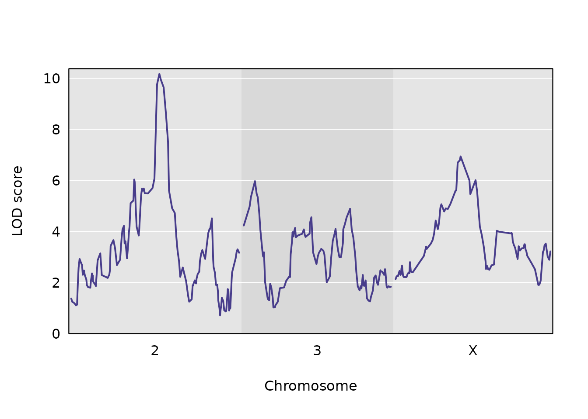

and the grammar of graphics (`ggplot2`) version.

``` r

autoplot(scan_apr, DOex$pmap)
```

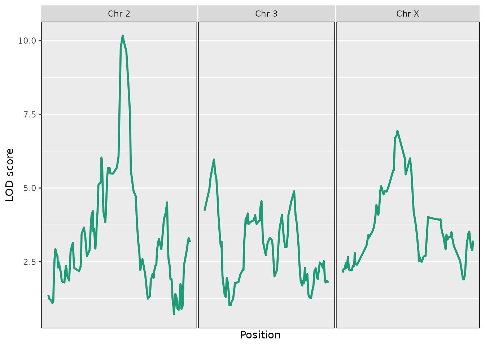

## Genome Allele Scan for Chr 2

Subset to chr 2.

``` r

DOex <- DOex[,"2"]
apr <- subset(apr, chr = "2")
```

### Scan chromosome and summarize peak

``` r

scan_apr <- qtl2::scan1(apr, DOex$pheno)
```

``` r

qtl2::find_peaks(scan_apr, DOex$pmap)
```

    ##   lodindex       lodcolumn chr      pos      lod
    ## 1        1 OF_immobile_pct   2 96.84223 10.17331

``` r

plot(scan_apr, DOex$pmap)
```

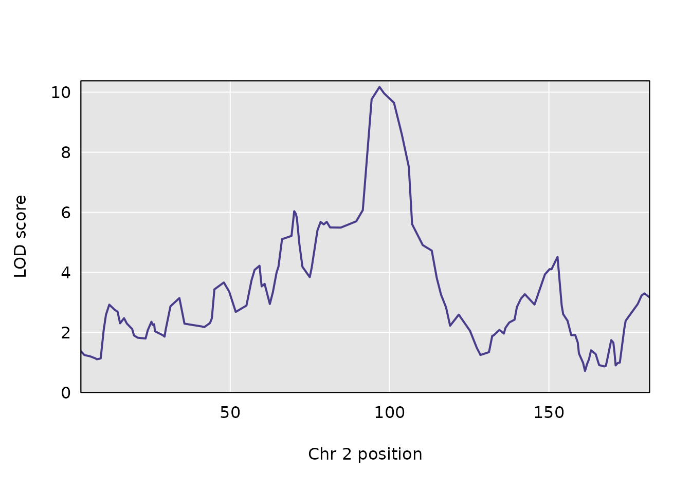

``` r

autoplot(scan_apr, DOex$pmap)
```

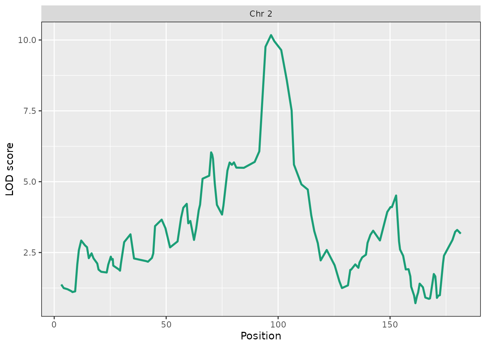

### Examine coefficients for the 8 alleles

``` r

coefs <- qtl2::scan1coef(apr, DOex$pheno)
```

New `summary` method:

``` r

summary(coefs, scan_apr, DOex$pmap)
```

    ## # A tibble: 1 × 14
    ##   pheno       chr     pos marker   lod     A     B     C     D     E     F     G
    ##   <chr>       <fct> <dbl> <chr>  <dbl> <dbl> <dbl> <dbl> <dbl> <dbl> <dbl> <dbl>
    ## 1 OF_immobil… 2      96.8 UNC02…  10.2 -6.93 -3.80 -6.27 -5.97 -30.1 -14.3 -3.87
    ## # ℹ 2 more variables: H <dbl>, intercept <dbl>

``` r

plot(coefs, DOex$pmap, 1:8, col = qtl2::CCcolors)
```

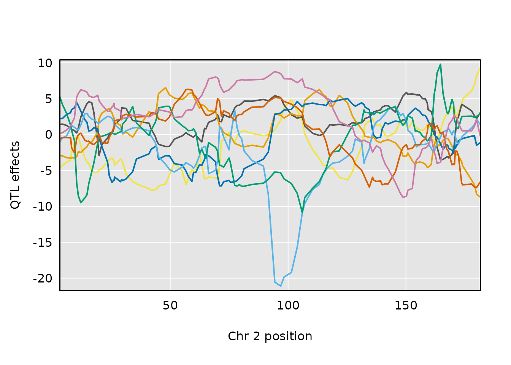

``` r

autoplot(coefs, DOex$pmap)
```

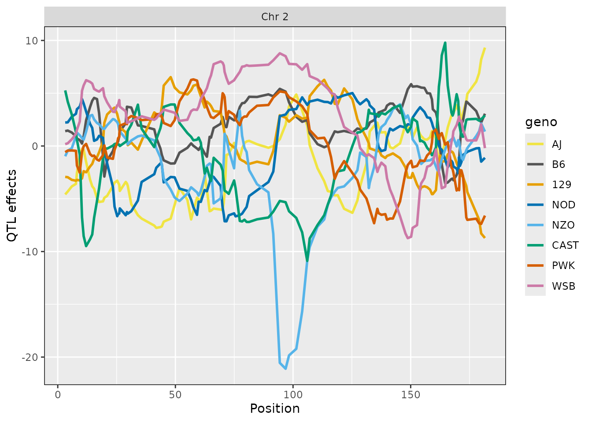

Plot allele effects over LOD scan.

``` r

plot(coefs, DOex$pmap, 1:8, col = qtl2::CCcolors, scan1_output = scan_apr)
```

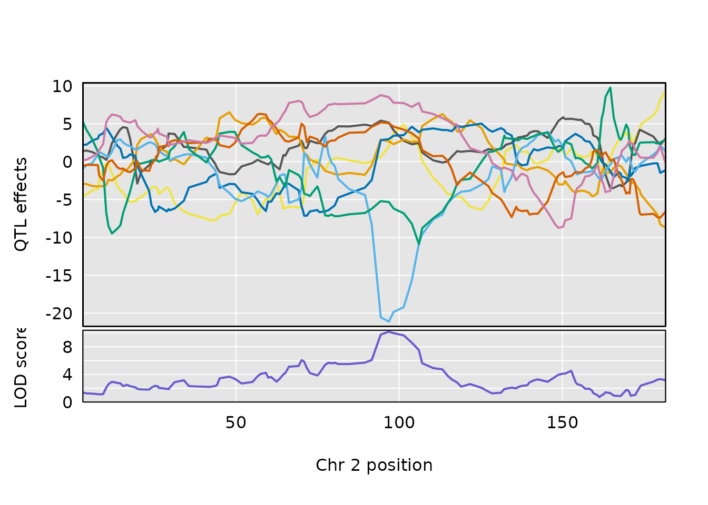

``` r

autoplot(coefs, DOex$pmap, scan1_output = scan_apr,
         legend.position = "none")
```

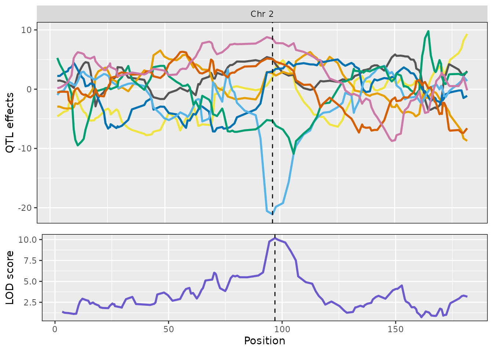

Examine just some of the founder effects, without centering.

``` r

plot(coefs, DOex$pmap, c(5,8), col = qtl2::CCcolors[c(5,8)])
```

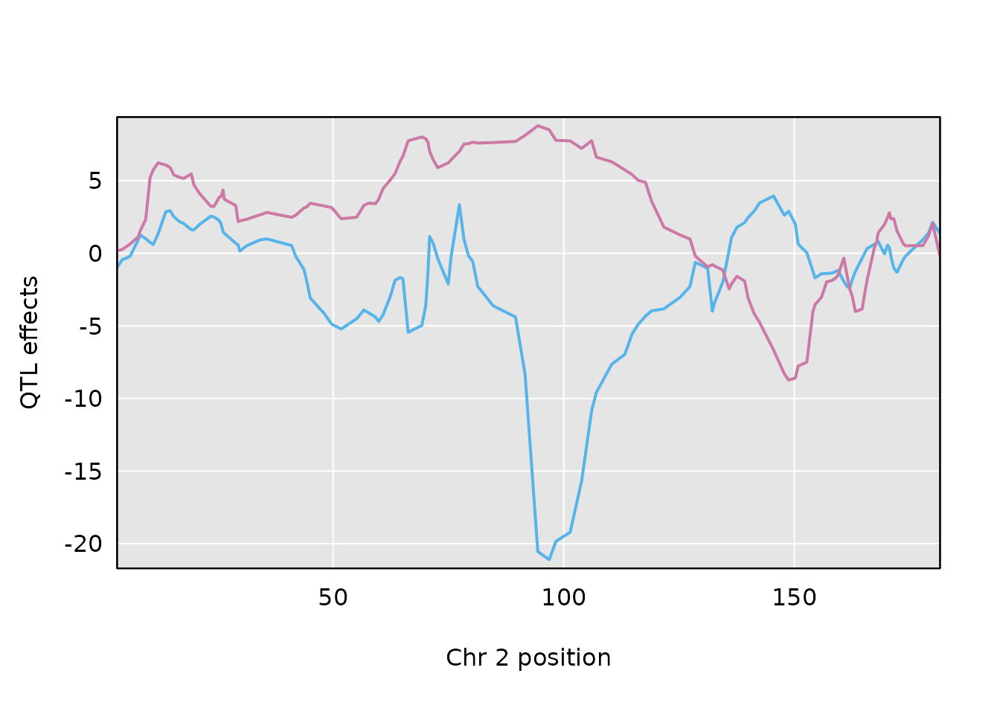

``` r

autoplot(coefs, DOex$pmap, c(5,8))
```

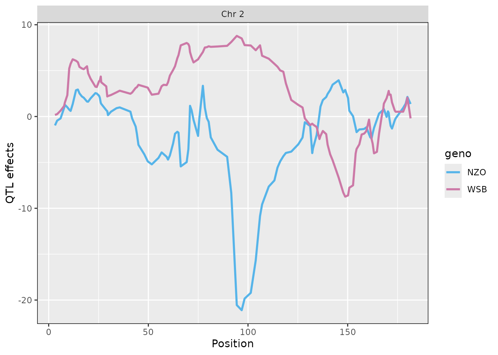

``` r

autoplot(coefs, DOex$pmap, c(5,8), facet = "geno")
```

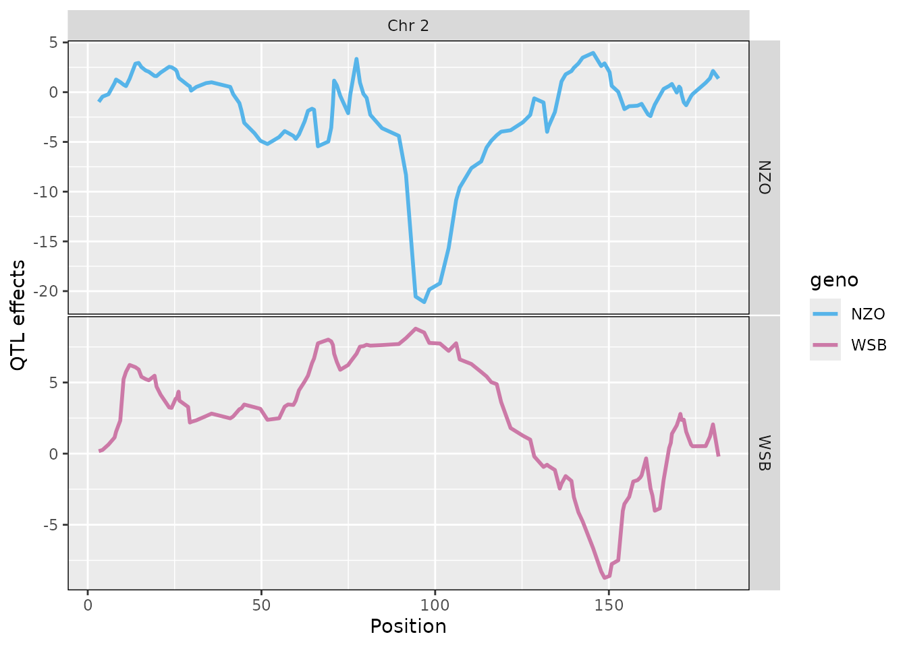

``` r

plot(coefs, DOex$pmap, 4:5, col = qtl2::CCcolors[4:5], scan1_output = scan_apr)
```

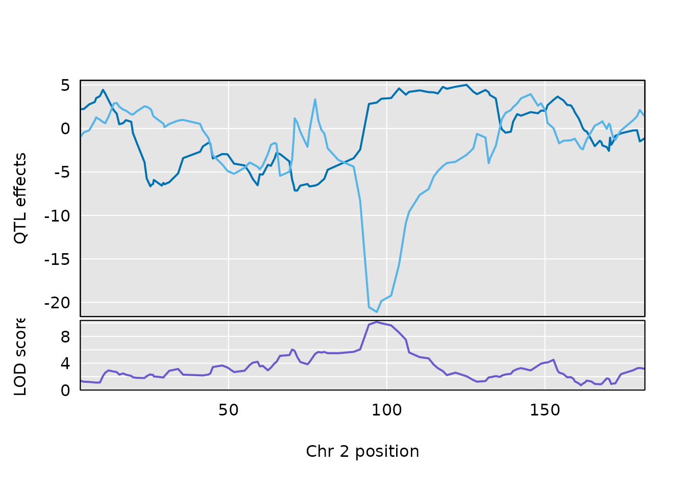

``` r

autoplot(coefs, DOex$pmap, 4:5, scan1_output = scan_apr, legend.position = "none")
```

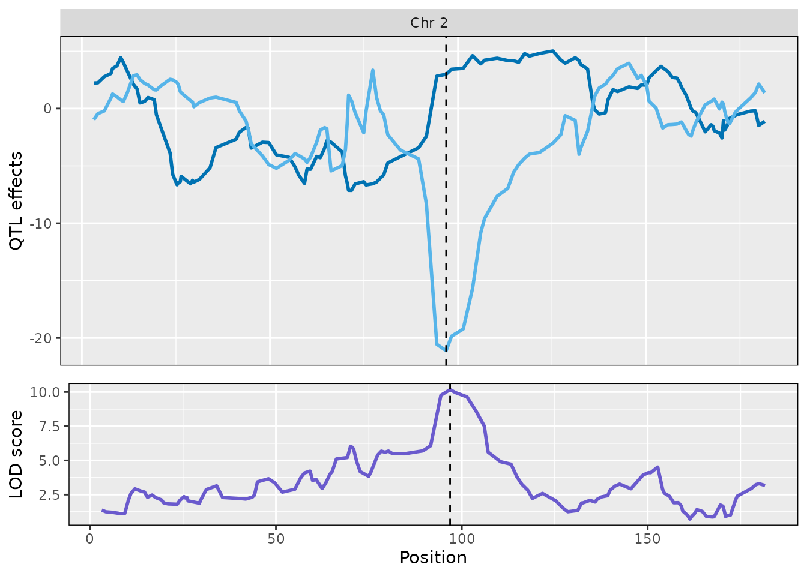

## SNP Association Mapping

For SNP association mapping, be sure to use the genotype allele pair
probabilities `pr` rather than the additive model allele probabilities
`apr`. Download pre-calculated genotype probabilities (~19 MB) and
subset to Chr 2.

``` r

tmpfile <- tempfile()
file <- paste0("https://raw.githubusercontent.com/rqtl/",
               "qtl2data/master/DOex/DOex_genoprobs.rds")
download.file(file, tmpfile)
pr <- readRDS(tmpfile)
unlink(tmpfile)
pr <- subset(pr, chr = "2")
```

Or, alternatively, calculate directly using the subsetted `DOex`.

``` r

pr <- qtl2::calc_genoprob(DOex, error_prob=0.002)
```

Download SNP information from web.

``` r

filename <- file.path("https://raw.githubusercontent.com/rqtl",
                      "qtl2data/master/DOex", 
                      "c2_snpinfo.rds")
tmpfile <- tempfile()
download.file(filename, tmpfile, quiet=TRUE)
snpinfo <- readRDS(tmpfile)
unlink(tmpfile)
```

Or alternatively, use `query` function approach.

``` r

snpdb_file <- system.file("extdata", "cc_variants_small.sqlite", package="qtl2")
query_variant <- qtl2::create_variant_query_func(snpdb_file)
snpinfo <- query_variant("2", 96.5, 98.5)
```

The SNP routines in ‘qtl2ggplot’ can distinguish SNP variants
artificially add `type` to `snpinfo` with about 20% `DEL` to show how
variants get plotted.

``` r

variants <- c("snp","indel","SV","INS","DEL","INV")
snpinfo$type <- 
  factor(
    sample(
      c(sample(variants[-1], 5000, replace = TRUE),
        rep("snp", nrow(snpinfo) - 5000))),
    variants)
```

Perform SNP association mapping. It is possible to use
[`qtl2::scan1snps`](https://rdrr.io/pkg/qtl2/man/scan1snps.html)
instead, which bundles these three routines, but we want to have the SNP
probabilities for later use.

``` r

snpinfo <- qtl2::index_snps(DOex$pmap, snpinfo)
snppr <- qtl2::genoprob_to_snpprob(pr, snpinfo)
scan_snppr <- qtl2::scan1(snppr, DOex$pheno)
```

Plot results.

``` r

plot(scan_snppr, snpinfo, drop_hilit = 1.5)
```

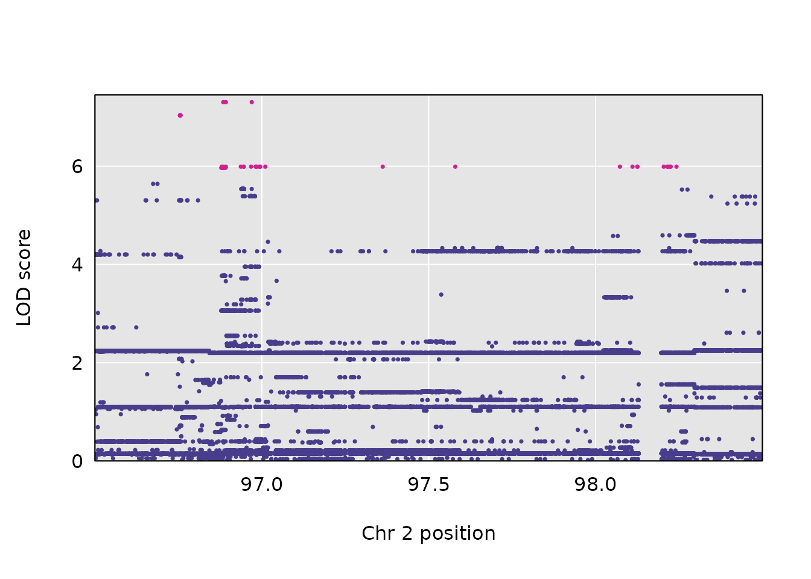

``` r

autoplot(scan_snppr, snpinfo, drop_hilit = 1.5)
```

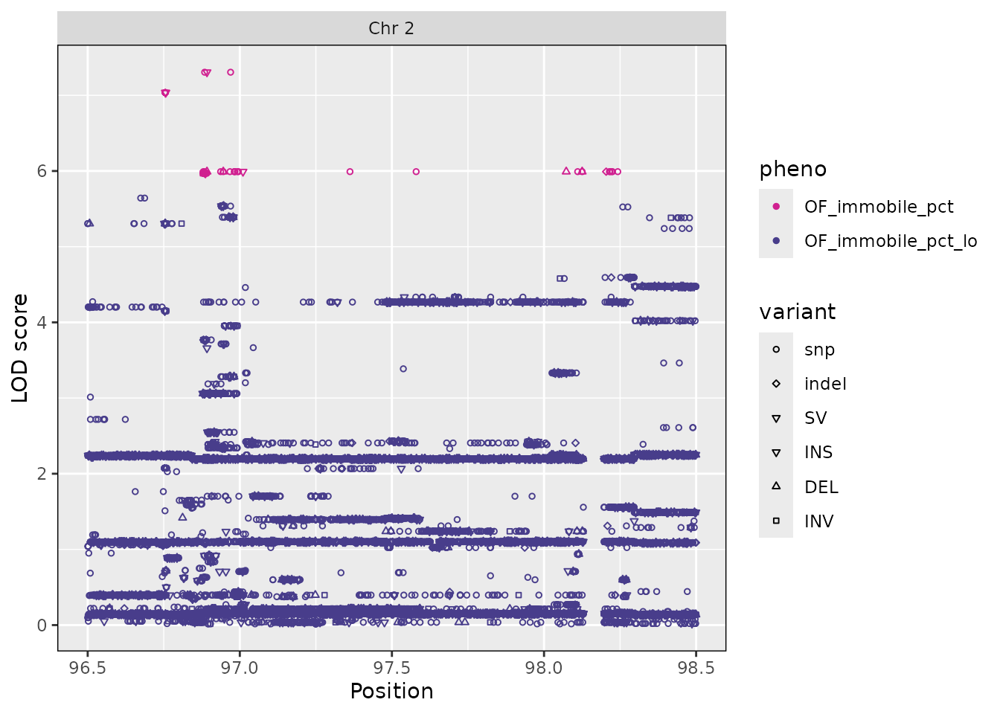

Plot just subset of distinct SNPs

``` r

plot(scan_snppr, snpinfo, show_all_snps=FALSE, drop_hilit = 1.5)
```

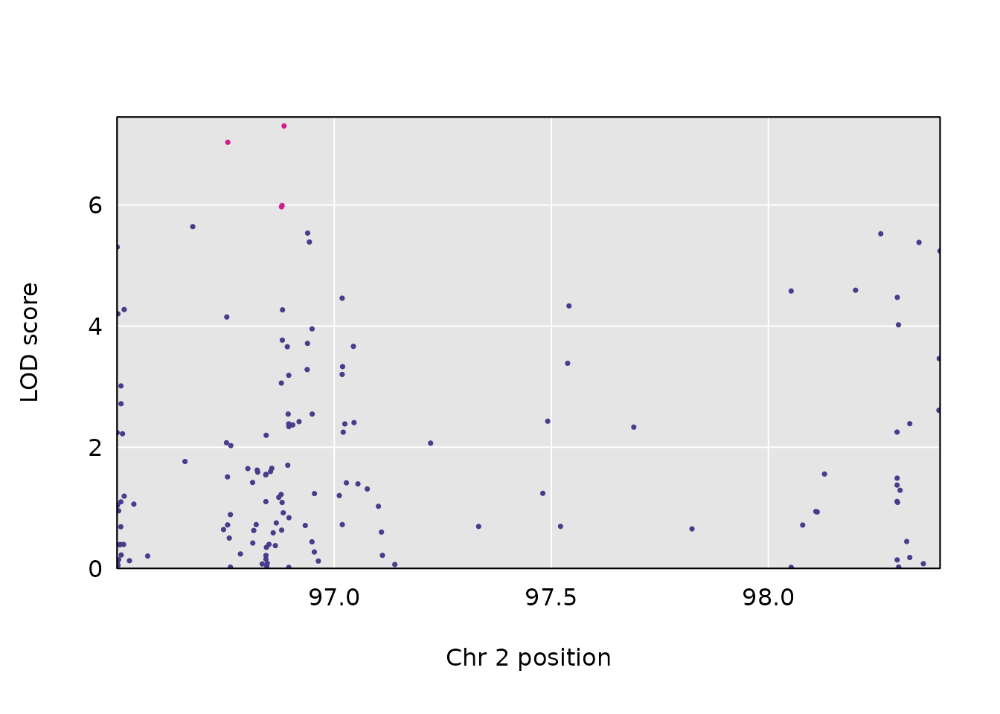

``` r

autoplot(scan_snppr, snpinfo, show_all_snps=FALSE, drop_hilit = 1.5)
```

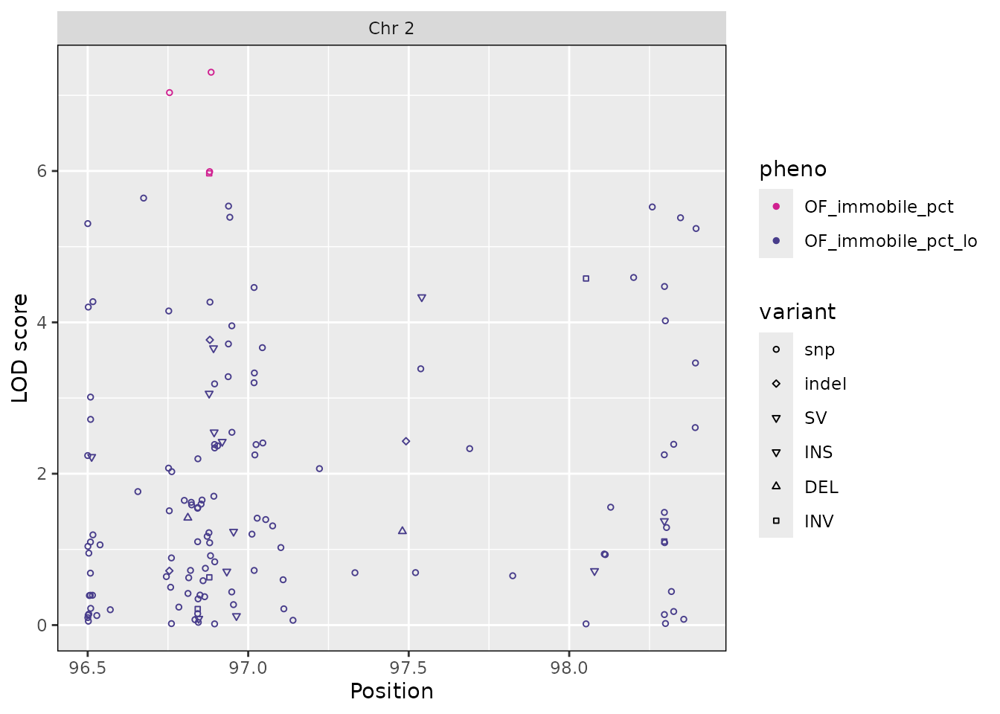

Highlight the top snps (with LOD within 1.5 of max). Show as open
circles of size 1.

``` r

plot(scan_snppr, snpinfo, drop_hilit=1.5, cex=1, pch=1)
```

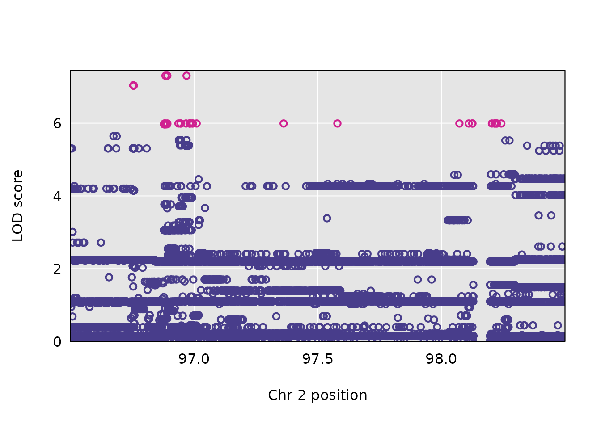

``` r

autoplot(scan_snppr, snpinfo, drop_hilit=1.5, cex=2)
```

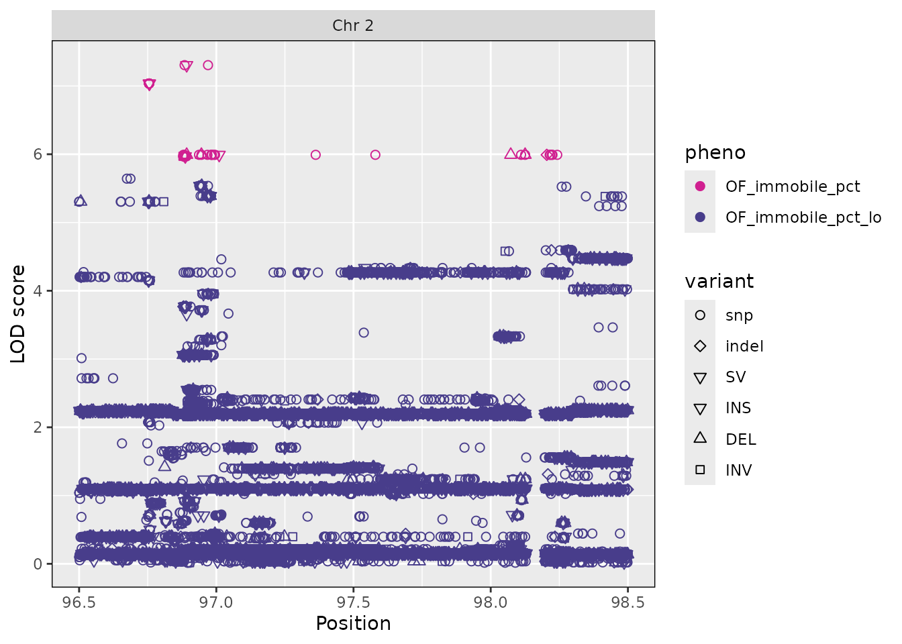

## Strain Distribution Pattern (SDP) Scan

SNP assocation mapping is more useful with plots that emphasized the
strain distribution pattern (SDP), which separate out SNPs based on
their SDP and plot the top patterns. For instance `sdp = 52` corresponds
to pattern `ABDGH:CEF`. That is, the SNP genotype `"AA"` resulting from
[`qtl2::genoprob_to_snpprob`](https://rdrr.io/pkg/qtl2/man/genoprob_to_snpprob.html)
applied to `pr` corresponds to any of the 36 allele pairs with the two
alleles drawn from the reference (`ref`) set of `ABDGH` (15 pairs:
`AA, AB, AD, AG, AH, BB, BD, BG, BH, DD, DG, DH, GG, GH, HH`), `"BB"`
has two alleles from the alternate (`alt`) set `CEF` (6 pairs:
`CC, CE, CF, EE, EF, FF`), and `"AB"` has one from each for the
heterogeneous (`het`) set (15 pairs: `AC, AE, ..., HF`). There are 255
possible `sdp`s, but only a few (4 in our example) that need be examined
carefully. One can think of these as a subset of markers for genome
scan, where interest is only in those SNPS following a particular `sdp`;
as with genome scans, we can fill in for missing data. That is, only a
few SNPs may show a particular pattern, but key differences might be
seen nearby if we impute SNPs of the same pattern. Here we highlight
SDPs in SNPs within 3 of max; connect with lines.

``` r

autoplot(scan_snppr, snpinfo, patterns="all", drop_hilit=3, cex=2)
```

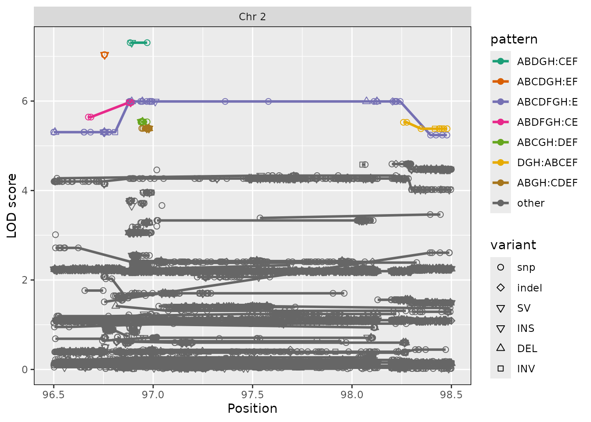

Highlight only top SDP patterns in SNPs.

``` r

autoplot(scan_snppr, snpinfo, patterns="hilit", drop_hilit=3, cex=2)
```

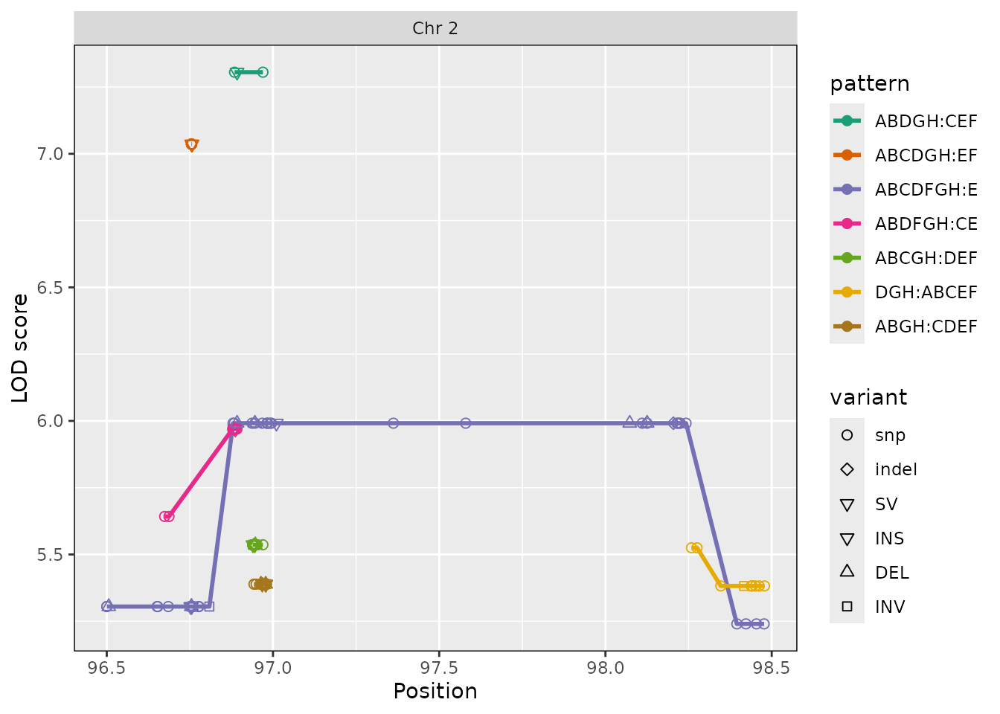

Looking at all SNPS is more useful than just focusing on mapped SNPs.

``` r

autoplot(scan_snppr, snpinfo, patterns="hilit", drop_hilit=3, cex=2,
     show_all_snps = FALSE)
```

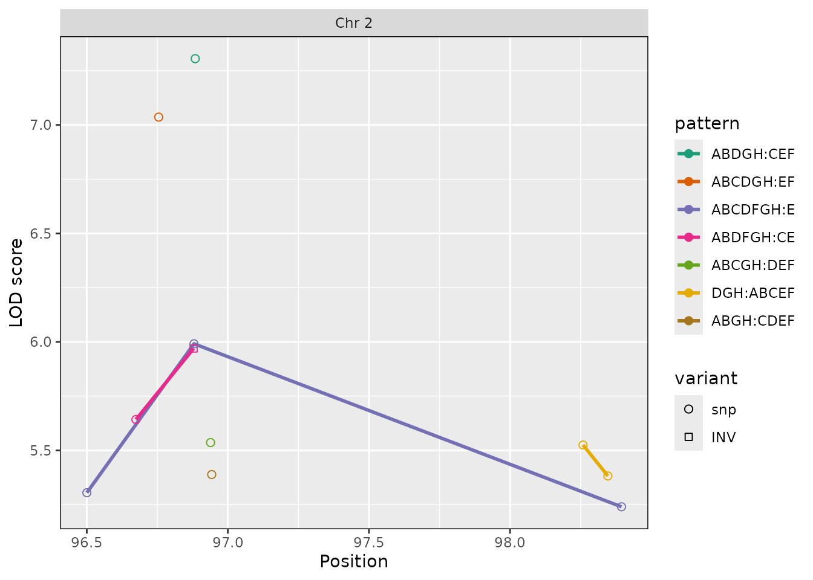

## Genes in Peak Region

Download Gene info for DOex from web via RDS.

``` r

filename <- file.path("https://raw.githubusercontent.com/rqtl",
                      "qtl2data/master/DOex", 
                      "c2_genes.rds")
tmpfile <- tempfile()
download.file(filename, tmpfile, quiet=TRUE)
gene_tbl <- readRDS(tmpfile)
unlink(tmpfile)
```

Or alternatively use `query` function approach.

``` r

dbfile <- system.file("extdata", "mouse_genes_small.sqlite", package="qtl2")
query_genes <- qtl2::create_gene_query_func(dbfile, filter="(source=='MGI')")
gene_tbl <- query_genes("2", 96.5, 98.5)
```

Plot genes. These can be aligned with the SNP association map or SDP
scans.

``` r

qtl2::plot_genes(gene_tbl, xlim = c(96,99))
```

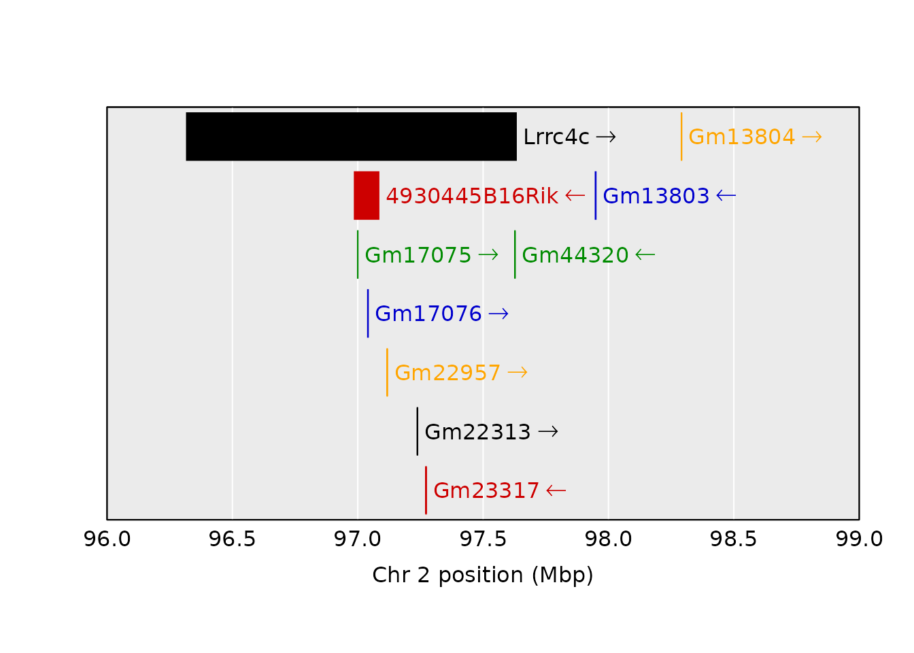

``` r

ggplot_genes(gene_tbl)
```

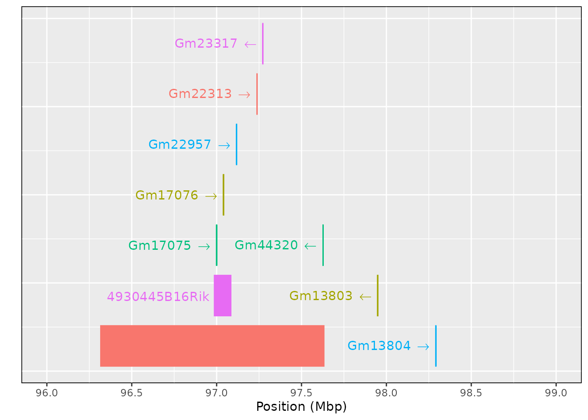

## Multiple Phenotypes

Plot routines (except scan patterns for now) can accommodate multiple
phenotypes. At present, it is best to stick to under 10. In the preambl
of this document, a second phenotype, `asin`, was artifically created
for illustration purposes.

Create artificial second phenotype as arcsic sqrt of first one.

``` r

DOex$pheno <- cbind(DOex$pheno, 
                    asin = asin(sqrt(DOex$pheno[,1] / 100)))
```

### Genome scans for multile phenotypes

Redo genome allele scans on both phenotypes.

``` r

scan_apr <- qtl2::scan1(apr, DOex$pheno)
```

``` r

qtl2::find_peaks(scan_apr, DOex$pmap)
```

    ##   lodindex       lodcolumn chr      pos       lod
    ## 1        1 OF_immobile_pct   2 96.84223 10.173313
    ## 2        2            asin   2 96.84223  9.422816

Similar summary using new `summary` method:

``` r

summary(scan_apr, DOex$pmap)
```

    ## # A tibble: 2 × 5
    ##   pheno           chr     pos marker         lod
    ##   <chr>           <fct> <dbl> <chr>        <dbl>
    ## 1 OF_immobile_pct 2      96.8 UNC020114284 10.2 
    ## 2 asin            2      96.8 UNC020114284  9.42

``` r

plot(scan_apr, DOex$pmap, 1)
plot(scan_apr, DOex$pmap, 2, add = TRUE, col = "red")
```

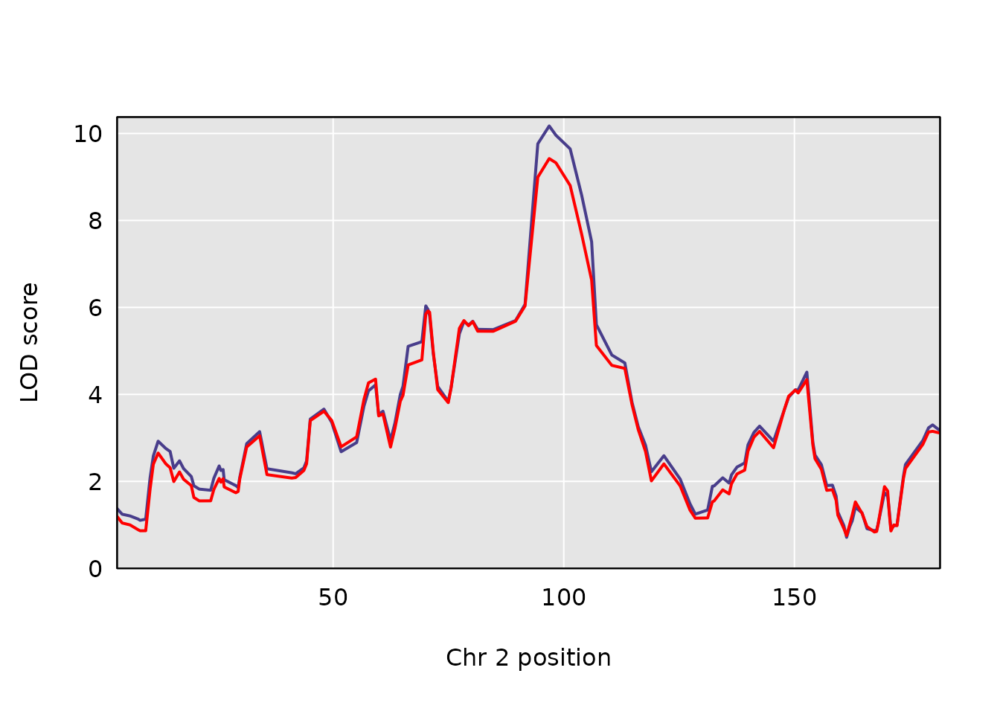

``` r

autoplot(scan_apr, DOex$pmap, 1:2)
```

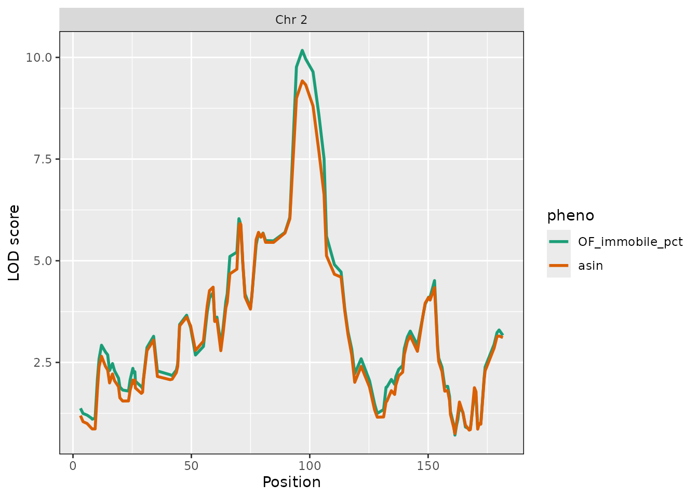

``` r

autoplot(scan_apr, DOex$pmap, 1:2, facet="pheno", scales = "free_x", shape = "free_x")
```

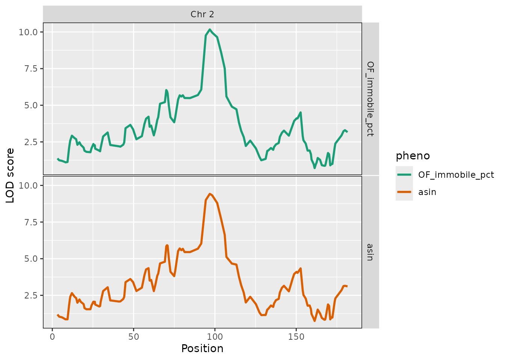

### SNP scans for multiple phenotypes

Redo SNP scans on both phenotypes.

``` r

scan_snppr <- qtl2::scan1(snppr, DOex$pheno)
```

Using new `summary` method. The summary includes a range (`min` and
`max`) for `pos`, as there could be multiple SNPs across a range of
positions.

``` r

summary(scan_snppr, DOex$pmap, snpinfo)
```

    ## # A tibble: 8 × 7
    ##   pheno           max_pos min_pos   lod   sdp pattern   snp_id 
    ##   <chr>             <dbl>   <dbl> <dbl> <int> <chr>     <chr>  
    ## 1 OF_immobile_pct    97.0    96.9  7.31    52 ABDGH:CEF 3 SNPs 
    ## 2 OF_immobile_pct    96.8    96.8  7.04    48 ABCDGH:EF 12 SNPs
    ## 3 asin               96.8    96.8  6.55    48 ABCDGH:EF 12 SNPs
    ## 4 asin               97.0    96.9  6.49    52 ABDGH:CEF 3 SNPs 
    ## 5 OF_immobile_pct    98.2    96.9  5.99    16 ABCDFGH:E 25 SNPs
    ## 6 OF_immobile_pct    96.9    96.9  5.97    20 ABDFGH:CE 9 SNPs 
    ## 7 asin               97.0    96.9  5.56    56 ABCGH:DEF 88 SNPs
    ## 8 asin               97.0    96.9  5.32    60 ABGH:CDEF 69 SNPs

Plot results.

``` r

plot(scan_snppr, snpinfo, lodcolumn=1, cex=1, pch=1, drop_hilit = 1.5)
```


``` r

plot(scan_snppr, snpinfo, lodcolumn=2, cex=1, pch=1, drop_hilit = 1.5)
```

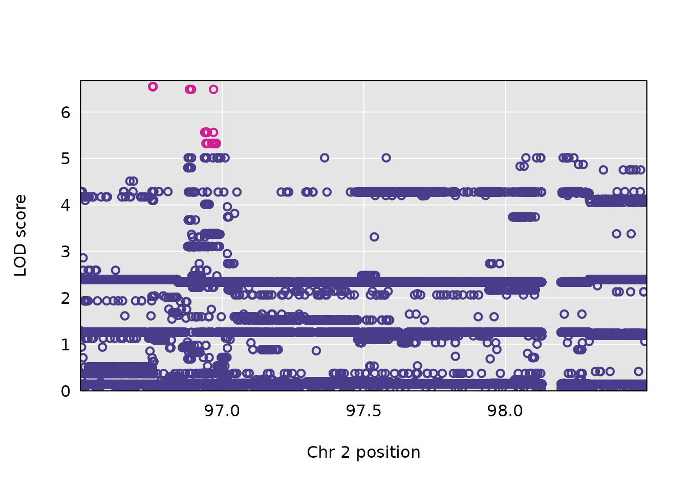

``` r

autoplot(scan_snppr, snpinfo, 1:2, facet="pheno",
         drop_hilit = 1.5)
```

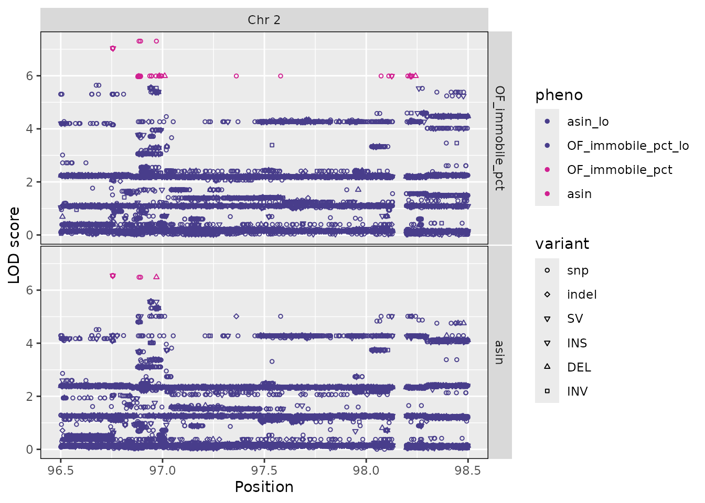

``` r

plot(scan_snppr, snpinfo, lodcolumn=1, cex=1, pch=1, 
     show_all_snps = FALSE, drop_hilit = 1.5)
```

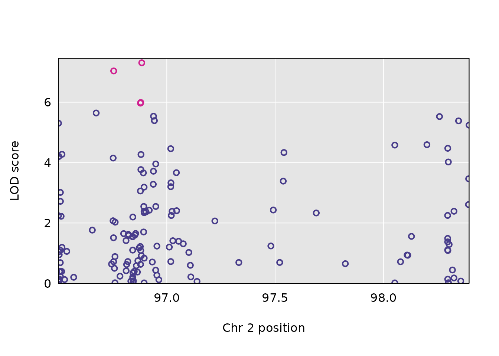

``` r

plot(scan_snppr, snpinfo, lodcolumn=2, cex=1, pch=1, 
     show_all_snps = FALSE, drop_hilit = 1.5)
```

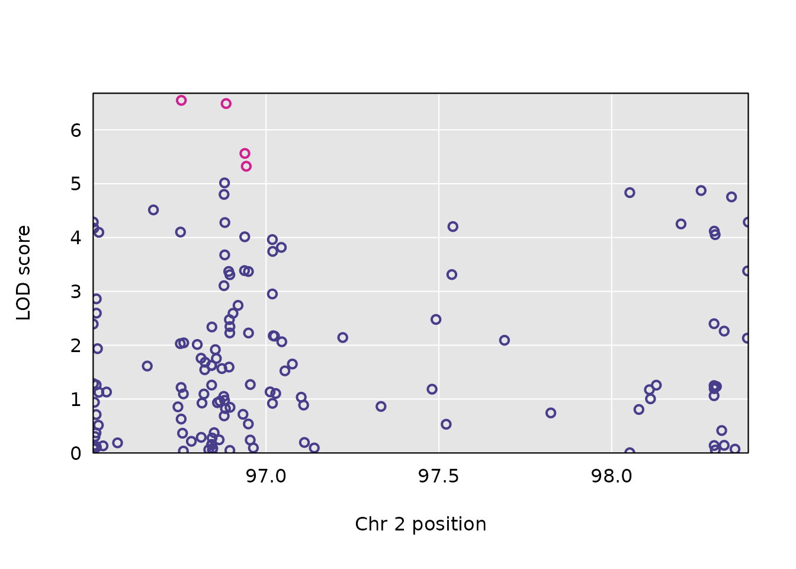

``` r

autoplot(scan_snppr, snpinfo, 1:2, show_all_snps = FALSE, facet="pheno",
         cex=2, drop_hilit = 1.5)
```

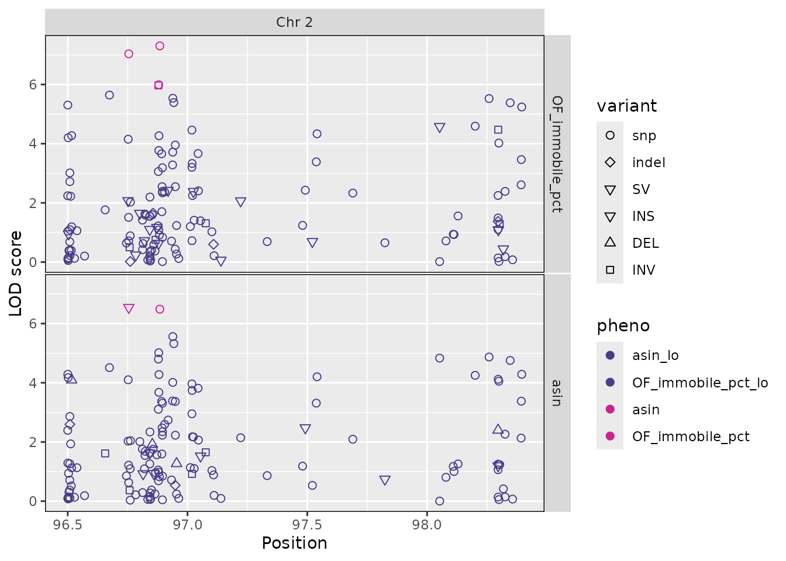

Note that in the `autoplot` (using `qtl2ggplot`), the `hilit` points for
the second trait are fewer than with the `plot` (using package ‘qtl2’).
This is because the `maxlod` for the faceted `autoplot` is across both
traits, and the other points for the second trait are too low.

``` r

autoplot(scan_snppr, snpinfo, 2, show_all_snps = FALSE, facet="pheno",
         cex=2, drop_hilit = 1.5)
```

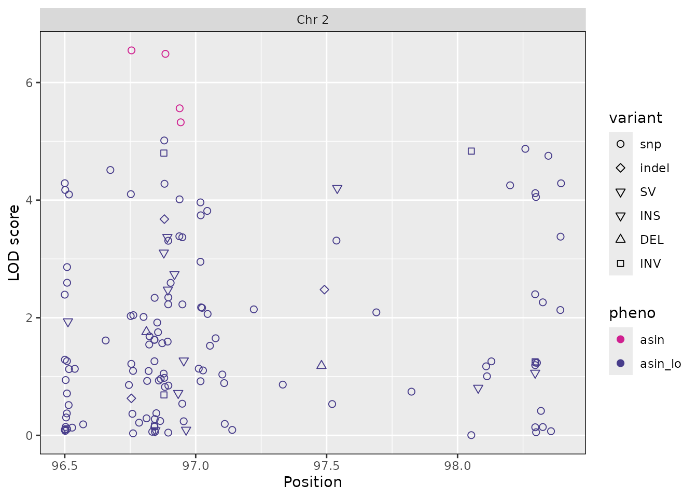

Distinguish high values by color but leave others gray.

``` r

autoplot(scan_snppr, snpinfo, 1:2,show_all_snps = FALSE,
         facet_var = "pheno", drop_hilit = 2,
         col=8, col_hilit=1:2, cex=2) +
  geom_hline(yintercept = max(scan_snppr) - 2, col = "darkgrey", linetype = "dashed")
```

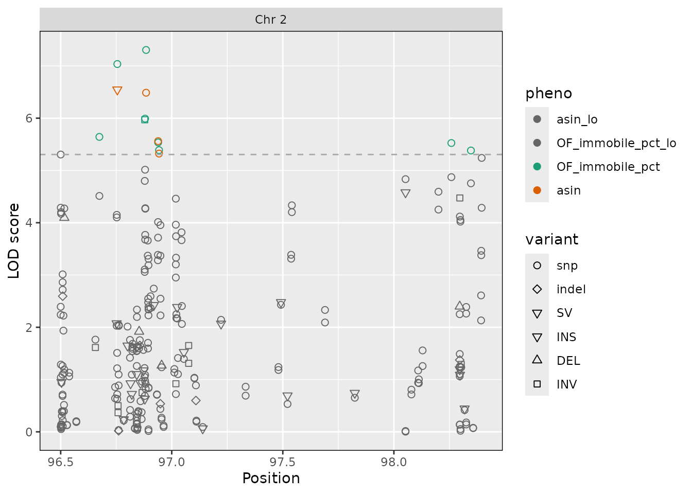 \### SDP scans
for multiple phenotypes

``` r

autoplot(scan_snppr, snpinfo, 2, patterns = "all",
             cex=2, drop_hilit=2)
```

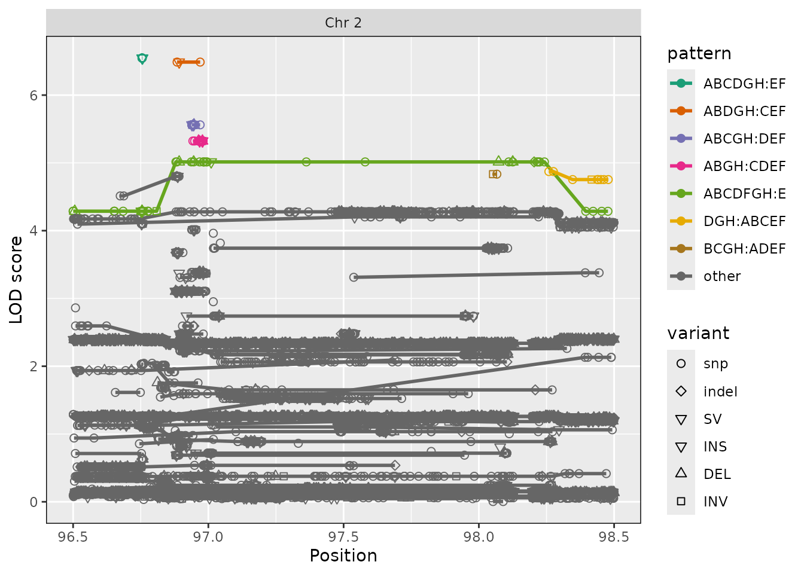

``` r

autoplot(scan_snppr, snpinfo, 1:2, patterns = "all", cex=2,
             facet = "pheno", drop_hilit=3)
```

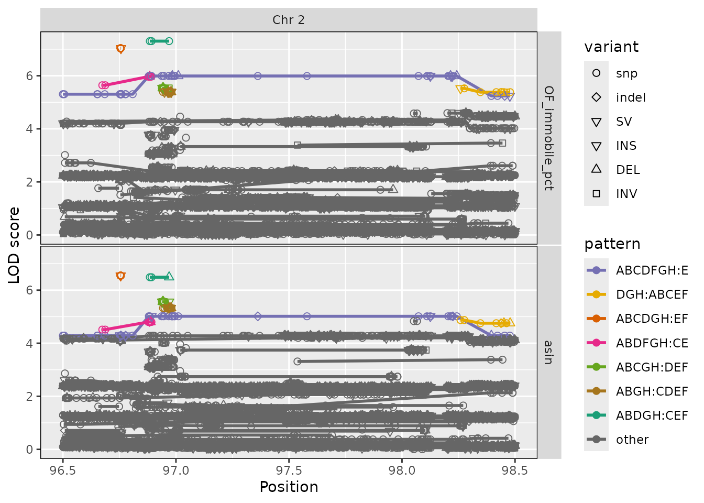

``` r

autoplot(scan_snppr, snpinfo, 1:2, patterns = "hilit", cex=2,
             drop_hilit=3, facet = "pheno", scales = "free")
```

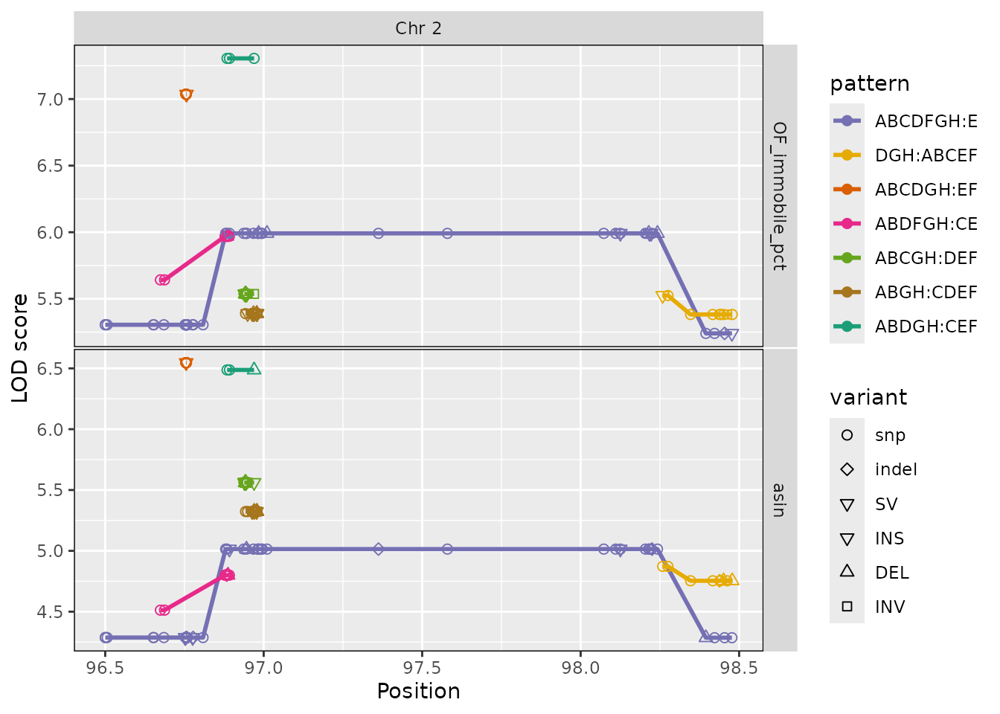

``` r

autoplot(scan_snppr, snpinfo, 1:2, patterns = "hilit",
         show_all_snps = TRUE, cex=2,
         drop_hilit=3, facet = "pattern")
```

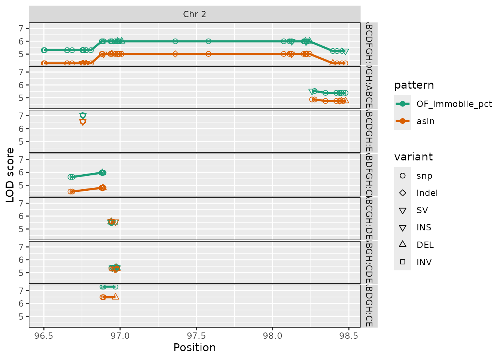

### LOD peaks for multiple phenotypes

``` r

(peaks <- qtl2::find_peaks(scan_apr, DOex$pmap, drop = 1.5))
```

    ##   lodindex       lodcolumn chr      pos       lod    ci_lo    ci_hi
    ## 1        1 OF_immobile_pct   2 96.84223 10.173313 91.60175 103.8778
    ## 2        2            asin   2 96.84223  9.422816 91.60175 103.8778

``` r

qtl2::plot_peaks(peaks, DOex$pmap)
```

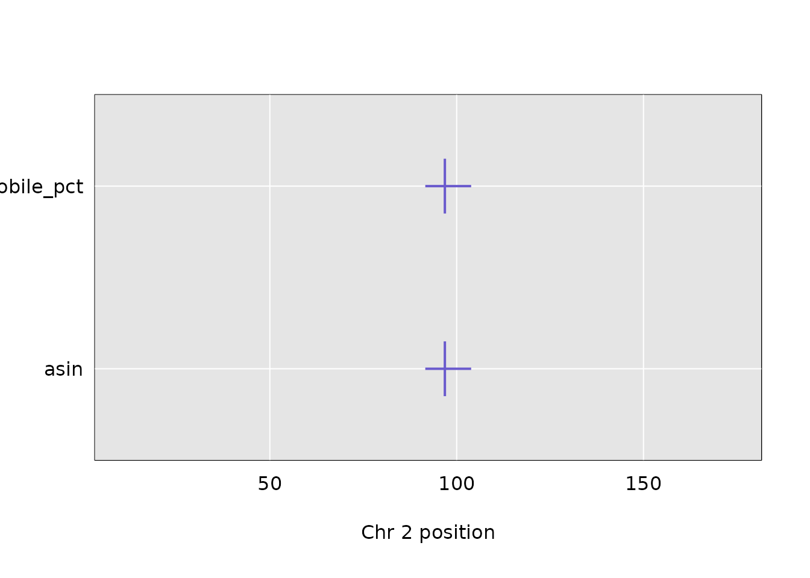

``` r

ggplot_peaks(peaks, DOex$pmap)
```

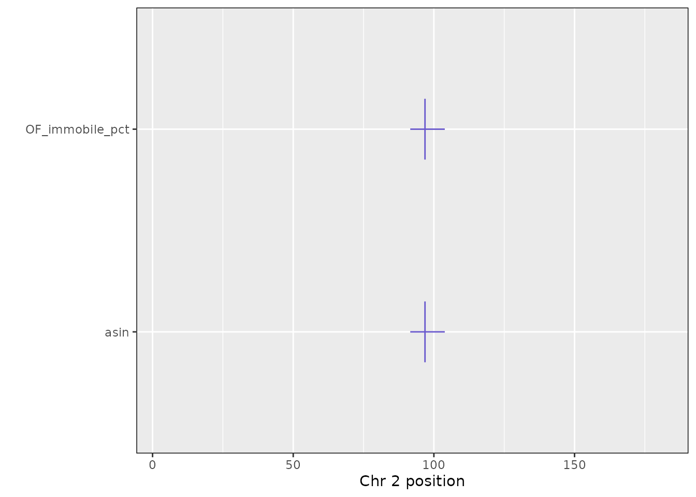

### Coefficients for multiple phenotypes

``` r

out <- listof_scan1coef(apr, DOex$pheno, center = TRUE)
```

New summary method:

``` r

summary(out, scan_apr, DOex$pmap)
```

    ## # A tibble: 2 × 14
    ##   pheno   chr     pos marker   lod      A       B       C      D       E       F
    ##   <chr>   <fct> <dbl> <chr>  <dbl>  <dbl>   <dbl>   <dbl>  <dbl>   <dbl>   <dbl>
    ## 1 OF_imm… 2      96.8 UNC02… 10.2  -7.49  -4.36   -6.83   -6.53  -30.6   -14.8  
    ## 2 asin    2      96.8 UNC02…  9.42 -0.108 -0.0661 -0.0936 -0.109  -0.392  -0.209
    ## # ℹ 3 more variables: G <dbl>, H <dbl>, intercept <dbl>

``` r

ggplot2::autoplot(out, DOex$pmap, scales = "free")
```

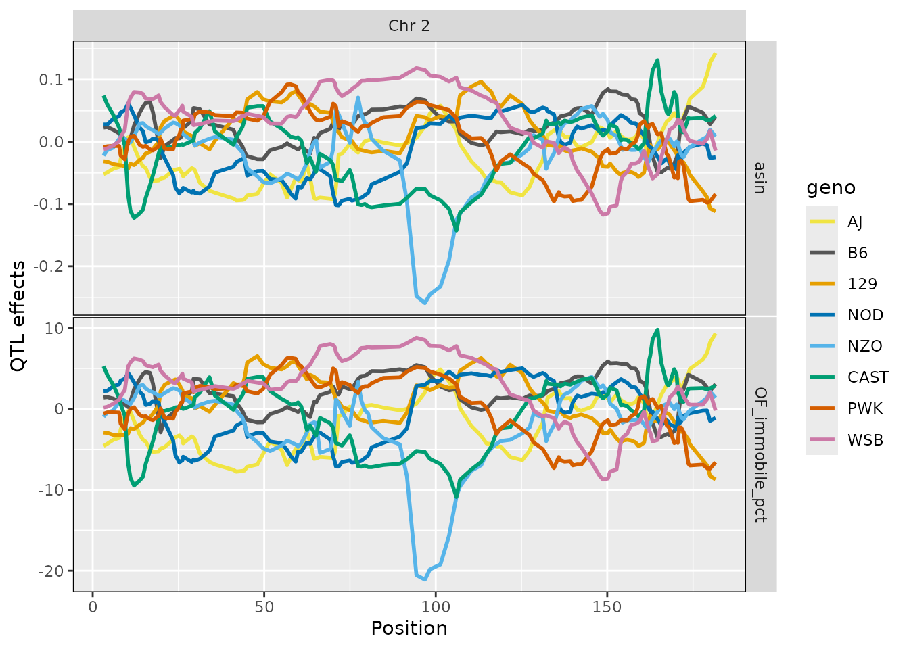

``` r

summary(out, scan_apr, DOex$pmap)
```

    ## # A tibble: 2 × 14
    ##   pheno   chr     pos marker   lod      A       B       C      D       E       F
    ##   <chr>   <fct> <dbl> <chr>  <dbl>  <dbl>   <dbl>   <dbl>  <dbl>   <dbl>   <dbl>
    ## 1 OF_imm… 2      96.8 UNC02… 10.2  -7.49  -4.36   -6.83   -6.53  -30.6   -14.8  
    ## 2 asin    2      96.8 UNC02…  9.42 -0.108 -0.0661 -0.0936 -0.109  -0.392  -0.209
    ## # ℹ 3 more variables: G <dbl>, H <dbl>, intercept <dbl>

## Coefficients for 36 allele pairs

This last section shows some very noisy images of coefficients for the
36 allele pairs. Generally, these will not be useful unless the cross is
quite large. See also package ‘qtl2pattern’.

QTL effects for 36 allele pair model. Note that they are quite unstable,
and the 36 allele pair max LOD is far from the peak for the additive
(haplotype) model. Only showing effects with at least one `E` allele.
Plots are truncated at +/-100 for viewability. Note also that
‘qtl2ggplot’ routines have some centering built in.

Find coefficients for 36 allele pair genome scan.

``` r

coefs36 <- qtl2::scan1coef(pr, DOex$pheno)
```

    ## Warning in qtl2::scan1coef(pr, DOex$pheno): Considering only the first
    ## phenotype.

All 36 allele pair QTL effects.

``` r

plot(coefs36, DOex$pmap, 1:36, col = 1:36, ylim=c(-100,100))
```

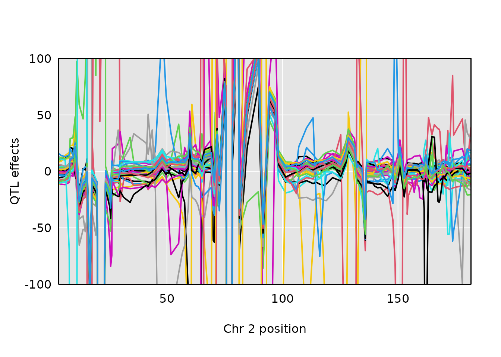

``` r

autoplot(coefs36, DOex$pmap, ylim=c(-100,100), colors = NULL, legend.position = "none")
```

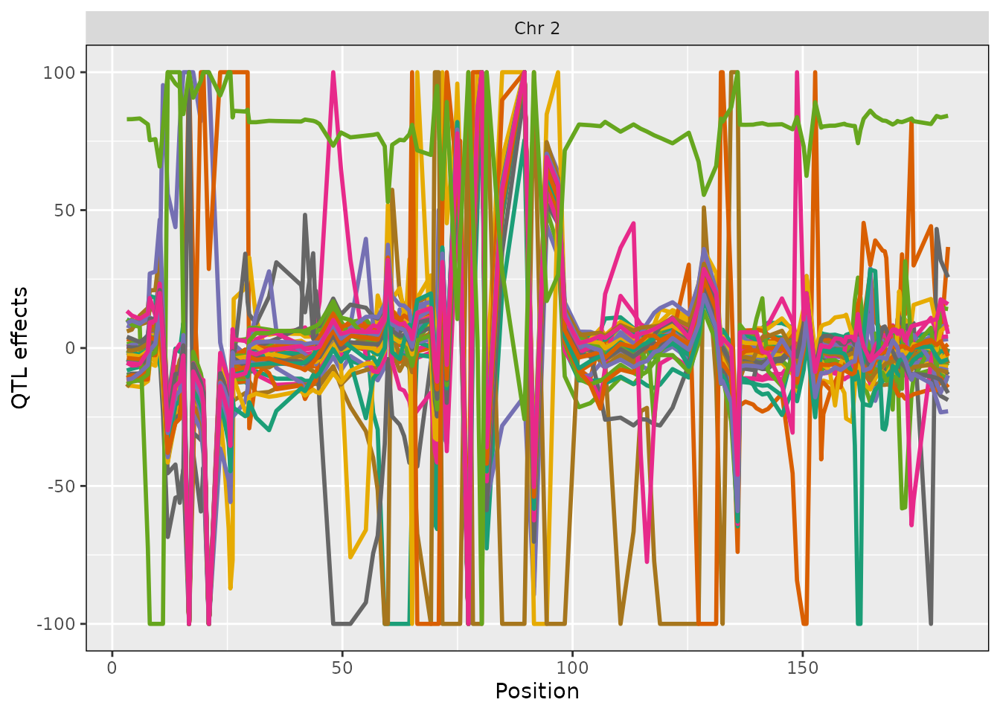

The `autoplot` is centered by default (so mean across all alleles is
mean of trait) to make coefficient plots easier to view. This can be
turned off with the hidden `center` option.

``` r

autoplot(coefs36, DOex$pmap, ylim=c(-100,100), center = FALSE, 
         colors = NULL, legend.position = "none")
```

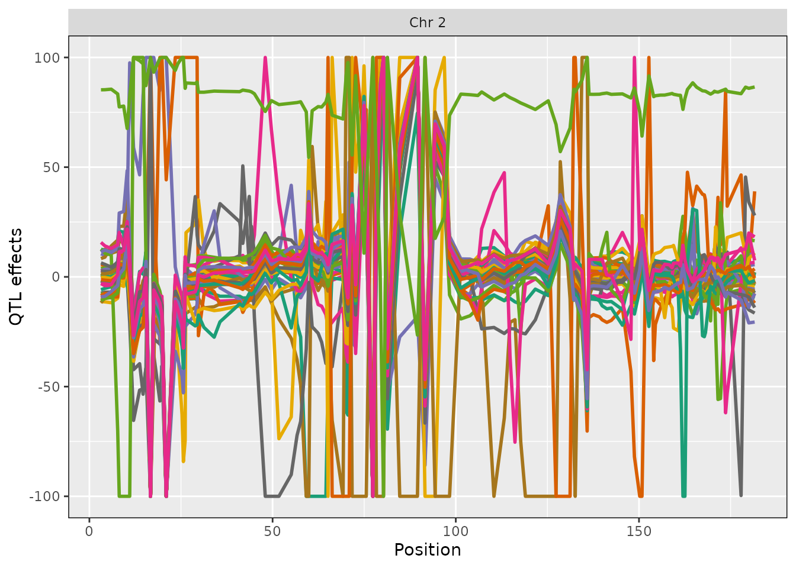

Only 8 allele pair QTL effects that contain `E`.

``` r

tmp <- qtl2ggplot:::modify_object(coefs36, 
                    coefs36[, stringr::str_detect(dimnames(coefs36)[[2]], "E")])
autoplot(tmp, DOex$pmap, ylim=c(-100,100))
```

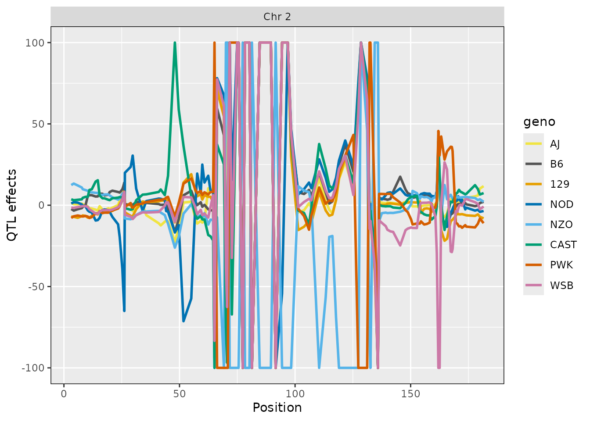
